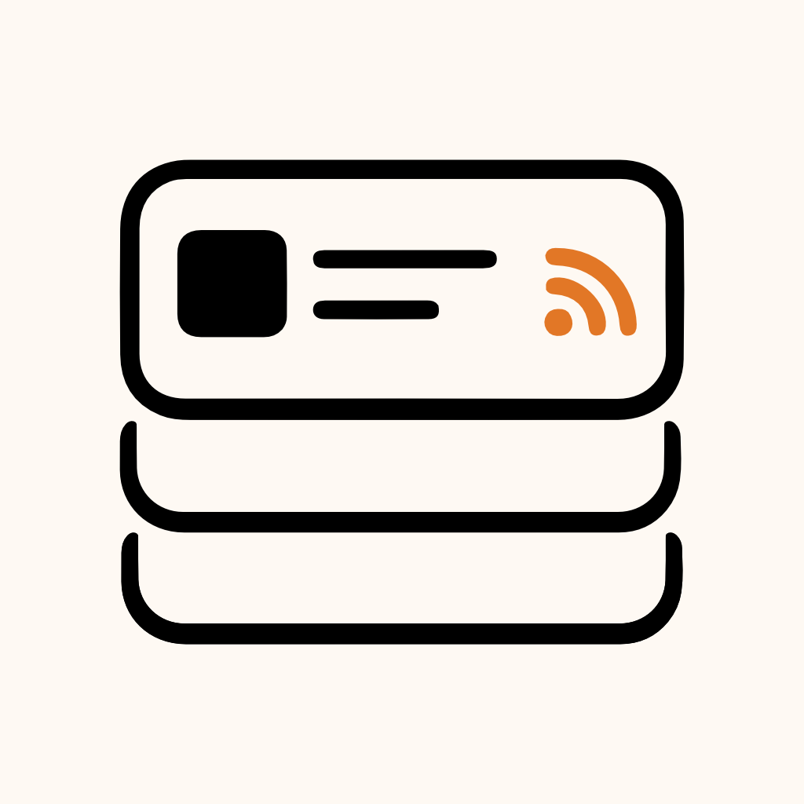

<p align="center">
    
    <br/>
    A minimalistic reader for following your favorite blogs, news, and websites.
    <br/>
    <br/>
</p>

---

# Feedmark

Feedmark is a minimalistic reader built with Expo, React Native, and TypeScript.

The goal is to create a quiet application for following RSS feeds, news, blogs, and websites without algorithmic timelines, telemetry, or distractions.

## Status

Feedmark is in early MVP development.

The current focus is RSS support. Website subscriptions and fallback behavior are planned for later.

## Project Structure

```text
src/
  app/            App root
  navigation/     Custom navigation
  screens/        App screens
  components/     Reusable UI components
  features/       RSS and subscription logic
  styles/         Shared theme
  utils/          Utility functions
